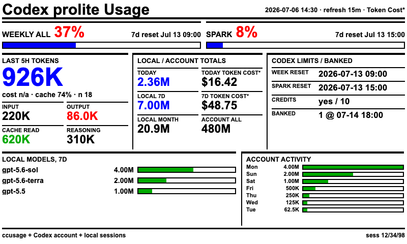
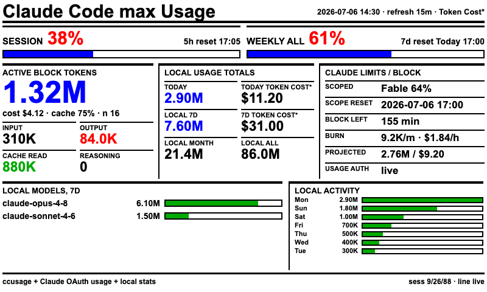

# TRMNL Agent Usage Dashboards

Local JSON feeds and 800x480 TRMNL Liquid templates for two e-paper dashboards:

- Codex CLI usage, token totals, native rate limits, credits, and banked reset expiry when available.
- Claude Code usage, active 5-hour block, burn rate, projection, native rate limits, and model mix.

The collector publishes aggregate metrics only. It does not publish prompts, raw JSONL records, credentials, local
paths, command history, or real webhook URLs.

## Demo Screens

These are renderer previews, not photographs of a physical device, generated from the synthetic fixtures in
`examples/`. They contain no real account, host, project, usage, or credential data.



*Codex screen, full-size color template, synthetic data.*



*Claude Code screen, full-size color template, synthetic data.*

Your device may not look like this. Seeed's TRMNL firmware guide says the reTerminal E1002 renders in monochrome on
the TRMNL path, so use a BWR-safe template unless you know your renderer preserves color. See
[Templates and devices](docs/templates.md#e1002-color-path).

## How It Works

```text
ccusage + local Codex/Claude metadata
  -> trmnl-agent-usage-collect
  -> codex.json + claude.json
  -> Terminus/BYOS: trmnl-agent-usage-serve -> Poll Extension
  -> TRMNL SaaS: trmnl-agent-usage-push -> Private Plugin Webhook
```

Run the collector on the machine that owns the Codex and Claude Code data. Terminus can run elsewhere and poll the
sanitized feeds over a trusted local network. TRMNL SaaS receives a compact copy of the dashboard fields through
outbound webhooks.

## Limitations

Worth knowing before you invest time in this:

- **It follows undocumented local formats.** Usage data is read from local CLI state and first-party endpoints that
  Codex and Claude Code can change without notice. A CLI update can make a card go `n/a` until this project catches up.
- **Costs are estimates.** They are computed from token counts at public API rates and will not match your invoice.
- **Claude limits need extra setup**, and depend on the command-line CLI. See [Requirements](#requirements).
- **Only the E1002 is tested**, and on the TRMNL firmware path it renders monochrome. Other 800x480 devices may work
  but are unverified. Other sizes need a custom template and visual testing.
- **The feed server has no authentication.** It is designed for a trusted LAN and must not face the internet.
- **Single machine.** The collector must run where the Codex and Claude Code data lives. If you relocate Claude's
  config directory, `CLAUDE_CONFIG_DIR` must point the CLI at the same place the collector reads.
- **Linux and macOS only.** Windows is untested. Among other things, two collectors sharing a cache directory could
  send the same refresh prompt.

## Requirements

- Python 3.11 or newer.
- `ccusage` on `PATH`.
- Codex CLI on `PATH` for Codex rate limits and plan data.
- Claude Code installed, for its local stats. Claude's limit percentages need one extra step: either the supplied
  statusline wrapper or the opt-in OAuth usage path below.
- An existing Terminus/BYOS installation, or two TRMNL SaaS Private Plugins (which may require a paid TRMNL add-on).
- Linux or macOS. Windows is untested.

The collector and feed server have no third-party Python dependencies.

> **If you mostly use the Claude Code desktop app, read this.** Claude's limit percentages come only from what the
> **command-line** Claude Code maintains. The desktop app never updates them, so the Claude limit cards drift to `n/a`
> within about eight hours. With both settings below, the collector runs one small Claude command once the stored
> access token expires. Your login itself stays valid the whole time, which is why `claude auth status` looks fine:
>
> ```sh
> export TRMNL_AGENT_USAGE_ENABLE_CLAUDE_OAUTH_USAGE=true
> export TRMNL_AGENT_USAGE_ENABLE_CLAUDE_OAUTH_REFRESH=true
> ```
>
> This costs about three minimal Claude prompts per day.
> [Details and cost controls](docs/data-reference.md#unattended-oauth-refresh).

## Quick Start

```sh
git clone https://github.com/ytwytw/trmnl-agent-usage-dashboards.git
cd trmnl-agent-usage-dashboards
python3 -m venv .venv
. .venv/bin/activate
python -m pip install -e .
python -m unittest discover -s tests
```

Set the storage folder and time zone, then generate the files once:

```sh
export TRMNL_AGENT_USAGE_CACHE_DIR="$HOME/.cache/trmnl-agent-usage"
export TRMNL_AGENT_USAGE_TIMEZONE="UTC"
trmnl-agent-usage-collect
```

That writes `codex.json`, `claude.json`, and `index.json` into the cache directory. `examples/env.example` documents
the main settings; `--help` lists the rest.

Now pick how your device gets them:

**Self-hosted Terminus (BYOS)** shares the files on your own network. Serve them, then add one Poll Extension per
dashboard:

```sh
trmnl-agent-usage-serve --host 0.0.0.0 --port 8787
curl http://127.0.0.1:8787/health
```

Never expose this server to the internet; it has no authentication.
[Full Terminus procedure](docs/deployment.md#self-hosted-terminusbyos).

**TRMNL cloud** takes the data by webhook. Create two Webhook Private Plugins and push each feed to its URL:

```sh
export TRMNL_AGENT_USAGE_CODEX_WEBHOOK_URL="https://trmnl.com/api/custom_plugins/REPLACE_ME"
export TRMNL_AGENT_USAGE_CLAUDE_WEBHOOK_URL="https://trmnl.com/api/custom_plugins/REPLACE_ME"
trmnl-agent-usage-push --dry-run && trmnl-agent-usage-push
```

Treat webhook URLs as credentials. [Full SaaS procedure](docs/deployment.md#trmnl-saas-webhooks).

## Templates

Every template supports both dashboards. Choose one for your device's size and colors:

| Template | Target |
| --- | --- |
| `templates/agent-usage-dashboard.liquid` | Full-size, color-capable 800x480 renderer |
| `templates/agent-usage-dashboard-bwr.liquid` | Full-size black/white/red-safe renderer |
| `templates/agent-usage-dashboard-bwr-half-horizontal.liquid` | Half-horizontal layout |
| `templates/agent-usage-dashboard-bwr-half-vertical.liquid` | Half-vertical layout |
| `templates/agent-usage-dashboard-bwr-quadrant.liquid` | Quadrant layout |

The only tested hardware is the Seeed Studio reTerminal E1002. Other 800x480 devices may work, but firmware and color
handling vary. Other sizes need a custom template and visual testing.

See [Templates and devices](docs/templates.md) for variable wiring, canvas settings, E1002 color limitations, and the
device adaptation policy.

## Refresh Cadence

These are separate settings:

- Collector: rebuild JSON every 15 minutes.
- Terminus Extension: poll and render every 15 minutes.
- Device: downloads and rotates screens on its own schedule.
- TRMNL SaaS: render according to the account and plugin refresh limits.

Changing the device interval does not make the source data newer than the collector interval.

## Data Behavior

The guiding rule: show what the tools actually report, or `n/a`. Never guess.

- Plan names and limits come directly from Codex and Claude Code.
- A stale or rejected percentage renders as `n/a` rather than being presented as current. A still-future reset time
  may remain as timing context, and a Codex bucket that reports no percentage at all renders as `0%`.
- `Token Cost*` converts tokens at public API rates. It is a reference figure, **not** your subscription bill.
- `Usage auth: run Claude` means the command-line Claude Code needs to make one request. The desktop app and
  `claude auth status --json` do not count; see the note under [Requirements](#requirements).

[Data sources and compatibility](docs/data-reference.md) covers metric provenance, fallback rules, pricing semantics,
and tested CLI versions.

## Disclaimer

This is a personal hobby project, provided as-is with **no warranty of any kind** and no guarantee of accuracy,
availability, or fitness for any purpose, per the [MIT License](LICENSE). Do not use it for billing, quota
enforcement, capacity planning, or any decision where being wrong costs you something. Verify anything that matters
against your provider's official usage page.

You run it at your own risk and are responsible for your own credentials, network exposure, and API usage, including
usage from the optional refresh feature. You are also responsible for complying with the terms of the providers and
platforms you connect to it.

Not affiliated with Anthropic, OpenAI, TRMNL, or Seeed Studio.

## Security and Privacy

- Generated feeds contain sanitized aggregate metrics but should still be treated as private operational data.
- Keep cache files, environment files, webhook URLs, credentials, logs, and local service definitions out of git.
- Bind the unauthenticated feed server only to a trusted interface or protect it with host firewall rules.
- Run `python scripts/audit_public_repo.py --history` before publishing changes.
- Report vulnerabilities according to [SECURITY.md](SECURITY.md).

The public repository intentionally retains only the maintainer's public GitHub handle, GitHub noreply commit address,
and repository URLs. Demo data, documentation hosts, and addresses are synthetic or reserved examples.

## Documentation

- [Deployment guide](docs/deployment.md): Terminus, TRMNL SaaS, scheduling, upgrades, and troubleshooting.
- [Data reference](docs/data-reference.md): metric provenance, fallback rules, privacy boundaries, and CLI compatibility.
- [Templates and devices](docs/templates.md): template selection, renderer wiring, and hardware support.
- [Security policy](SECURITY.md): vulnerability reporting and public-data rules.

## Development

```sh
python -m unittest discover -s tests
python -m py_compile trmnl_agent_usage/*.py scripts/audit_public_repo.py tests/*.py
sh -n scripts/claude_statusline_capture_wrapper.sh
python scripts/audit_public_repo.py
git diff --check
```

Use `examples/*.sample.json` for rendering and visual checks. Never generate public demo assets from live feeds.
